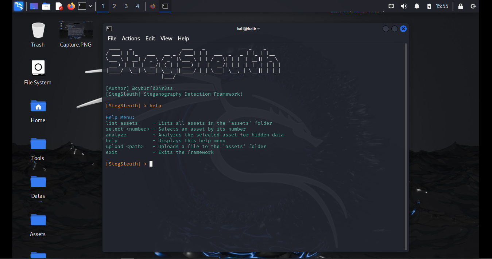

# StegSleuth
Steganography Detection Framework Used For Analyzing Files i.e Images, Videos, & Audios To Uncover Hidden Data, Gems Or Secrets.

# Output 

# Install Requirements
pip install -r requirements.txt

# Start StegSleuth 
python3 stegsleuth.py

# Start StegSleuth GUI 
python3 stegsleuth_gui.py
